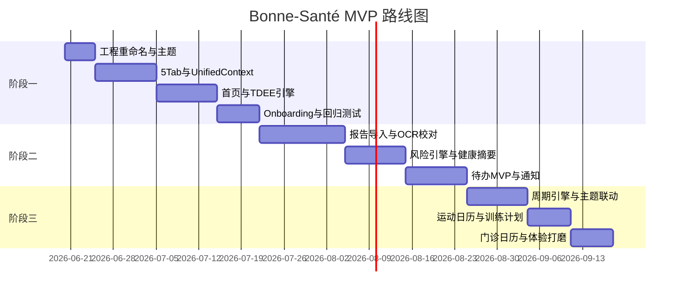

# Bonne-Santé 开发计划

**依据文档**：`PRD.txt` v2.4  
**更新日期**：2026-06-22（心情模式收尾 + 满月勋章 + 文档同步）  
**预计总工期**：11–16 周（三阶段 MVP）  
**代码路径**：`BonneSante/` · SwiftData Schema **v17**

---

## 1. 项目概览

| 项目 | 说明 |
|------|------|
| 产品 | 女性专属 iOS 健康助手（原生 App） |
| 核心原则 | **健康数据整合 × CalorieCop 减脂能力融合**，经 `UnifiedHealthContext` 统一驱动 |
| 技术栈 | SwiftUI、SwiftData、HealthKit、Vision、EventKit、DeepSeek + Qwen VL |
| 工程 | Target `BonneSante`，Bundle ID `com.bonnesante.app`，显示名 Bonne-Santé |
| 设计规范 | 莫兰迪色系、5 Tab、SF Symbols、`.regularMaterial` 卡片 |

---

## 2. 当前进度

```
[████████████████████] 阶段一 100% ✅

[██████████████████░░] 阶段二 ~90%（代码完成，真机走查进行中）

[██████████████████░░] 阶段三 ~90%（P1/P2 完成，待真机走查）

🚀 阶段三（2026-06-22 最新）
  - CycleEngine + HealthKit 经期 + 全局周期主题 ✅
  - WorkoutPlanEngine + AI 换动作 + 营养分日联动 ✅
  - 心情模式（天气排课 · 舞蹈/游泳 · AI 温馨提醒）✅
  - WorkoutCalendarView 月热力图 + 周统计 ✅
  - 门诊预约 OCR + EventKit ✅
  - 连续 7 天运动 · 满月勋章（我的页）✅
  - 微动效 / 分享摘要 / 首页洞察条 / 复查卡片 UI ✅
  - 本周安排 Mon→Sun 排序 ✅

📌 下一步
  - 阶段二/三 PRD 真机走查（`PHASE2_ACCEPTANCE.md`）
  - TestFlight / 正式 Schema 迁移策略
  - git 首次整理提交（BonneSante 工程）
```

---

## 3. 三阶段路线图



| 阶段 | 周期 | 交付价值 | 里程碑 |
|------|------|----------|--------|
| **阶段一** | 4–6 周 | 日常减脂助手可用 | 能记录饮食、看热量环、设目标、5 Tab 统一视觉 |
| **阶段二** | 4–6 周 | 健康档案闭环 | 导入体检、风险预警、待办提醒、健康反哺 AI |
| **阶段三** | 3–4 周 | 女性差异化体验 | 周期联动、运动日历、门诊日历、可上架水准 |

---

## 4. 阶段一详细任务（当前焦点）

### 4.1 任务分解与依赖

| ID | 任务 | 依赖 | 产出文件 | 估时 |
|----|------|------|----------|------|
| 1.0 | DeepSeek 迁移 | — | `DeepSeekService.swift` 等 | ✅ 完成 |
| 1.1 | Mac 编译验证 | 1.0 | — | ✅ 完成 |
| 1.2 | 重命名 Target / Bundle ID / 显示名 | 1.1 | `BonneSante.xcodeproj` | ✅ 完成 |
| 1.3 | 创建 `Theme.swift`（含 Dark Mode） | 1.2 | `Resources/Theme.swift` | 1d |
| 1.4 | 5 Tab 根导航骨架 | 1.3 | `ContentView.swift`、`TabRoot/` | 2d |
| 1.5 | 迁入 CalorieCop 页面到对应 Tab | 1.4 | 各 View 路径调整 | 2d |
| 1.6 | `UnifiedHealthContext` | 1.5 | `Services/UnifiedHealthContext.swift` | 3d |
| 1.7 | `IntegratedTDEEEngine` | 1.6 | `Services/IntegratedTDEEEngine.swift` | 2d |
| 1.8 | 扩展 `UserGoal`（体脂、期限） | 1.6 | `Models/UserGoal.swift` | 1d |
| 1.9 | 首页：热量环 + 周期条 + 快捷操作 | 1.7 | `CircularProgress`、`PhaseBar` | 3d |
| 1.10 | 升级 `AISettingsView` + Keychain | 1.4 | `AISettingsView.swift` | ✅ 完成 |
| 1.10b | Qwen 连接测试 + 大陆站默认 | 1.10 | `QwenAPIClient.swift` | ✅ 2026-06-22 |
| 1.11 | Onboarding 4 步流程 | 1.10 | `Views/Onboarding/` | ✅ 完成 |
| 1.11b | Onboarding / 目标设置 HealthKit 预填 | 1.11 | `HealthKitService.fetchBodyProfile` | ✅ 2026-06-22 |
| 1.12 | AI 顾问注入 Context 数据 | 1.6 | `AIAdvisorView.swift` | ✅ 完成 |
| 1.13 | 静态周期 tips + 空状态组件 | 1.9 | `Components/` | 1d |
| 1.14 | 阶段一回归测试 | 全部 | 测试记录 | ✅ 完成 |

**阶段一关键路径**：1.1 → 1.2 → 1.3 → 1.4 → 1.6 → 1.7 → 1.9 → 1.14

### 4.2 Tab 与页面映射

| Tab | SF Symbol | 迁入来源（CalorieCop） | 阶段一新增 |
|-----|-----------|------------------------|------------|
| 首页 | `heart.text.square.fill` | `DashboardView` 改造 | 热量环、周期条、tips |
| 健康 | `list.clipboard` | 占位 Empty State | 阶段二填充 |
| 减脂 | `figure.mind.and.body` | `FoodInput` + `Goals` + `History` | 统一入口 |
| 待办 | `checklist` | 占位 Empty State | 阶段二填充 |
| 我的 | `person.crop.circle` | `APIKeySetup` + 设置项 | 周期设定占位 |

### 4.3 阶段一验收清单（来自 PRD §5.1.3）

- [x] 中文食物录入 → 热量计入，首页环更新
- [x] Qwen 拍照识食 → 剩余热量实时更新（或文字录入降级）
- [x] 目标体重设定 → 每日预算正确
- [x] Apple Watch 消耗 → TDEE 联动（模拟器用估算值）
- [x] AI 顾问知晓目标与摄入
- [x] 5 Tab 可达且视觉统一

---

## 5. 阶段二详细任务

| 模块 | 核心任务 | 关键文件 |
|------|----------|----------|
| 数据模型 | Report、HealthMetric、RiskFlag、CheckupPlan、TodoItem | `Models/` |
| 报告导入 | Vision OCR + 强制校对页 + PDF 多页 | `ReportImporter.swift`、`Views/Health/ReportVerifyView.swift` |
| 评估引擎 | 10 条风险规则 + 趋势比对 | `HealthProfileEngine.swift`、`RiskAnalyzer.swift` |
| 健康 UI | 时间线、指标图、综合摘要 | `Views/Health/` |
| 待办 | 列表 CRUD + 本地通知 + 风险联动 | `Views/Tasks/`、`TodoService.swift` |
| 数据融合 | 异常指标 → AI 顾问 + 蛋白建议 | `UnifiedHealthContext` 扩展 |

**阶段二里程碑**：用户导入一份体检报告后，能在 3 分钟内看到风险摘要并生成复查待办。

---

## 6. 阶段三详细任务

| 模块 | 核心任务 | 状态 | 关键文件 |
|------|----------|------|----------|
| 周期 | CycleEngine + HealthKit 经期 | **进行中** | `CycleEngine.swift`、`CycleProfile.swift`、`HealthKitService.swift` |
| 主题联动 | 三期背景色 + `@Environment(\.cyclePhase)` | **已完成** | `Theme.swift`、`ContentView.swift` |
| Tips | 周期饮食/训练知识库 + 首页/营养 Tab | **进行中** | `CycleTipsCard.swift` |
| 训练 | WorkoutPlanEngine + 完成度 + AI 换动作 | **已完成首包** | `WorkoutPlanEngine.swift`、`WorkoutPlanView.swift` |
| 运动日历 | 月热力图 + 日详情 + 周统计 | **已完成首包** | `WorkoutCalendarView.swift`、`WorkoutCalendarEngine.swift` |
| 门诊 | 预约截图 OCR + EventKit | **已完成首包** | `ClinicAppointmentImportView.swift`、`CalendarService.swift` |
| 打磨 | 微动效、分享卡片 | 未开始 | `Theme.swift` |
| 成就 | 连续 7 天满月勋章 | **已完成** | `ExerciseStreakEngine.swift`、`ExerciseStreakBadgeCard.swift` |

---

## 7. 架构分层（开发时遵守）

```
Views（SwiftUI）
    ↕ ViewModels（@Observable）
    ↕ UnifiedHealthContext（单一真相源）
    ↕ Services / Engines（async throws，纯函数 Engine）
    ↕ SwiftData Models
    ↕ HealthKit / Vision / EventKit / DeepSeek / Qwen
```

**禁止**：
- View 直接计算 TDEE
- Tab 各自维护孤立健康状态
- 删除 CalorieCop 保留清单功能
- 未校对体检数据写入 Engine

---

## 8. 风险与应对

| 风险 | 影响 | 应对 |
|------|------|------|
| 体检 OCR 识别率低 | 阶段二体验差 | Vision + 强制校对；可选 DeepSeek 辅助 |
| Windows 无法本地编译 | 反馈周期长 | SSH Mac mini；每步小步提交 |
| HealthKit 真机依赖 | 测试受限 | 模拟器用 Mock + 真机周测 |
| API Key 费用 | 用户门槛 | BYOK + 优雅降级 + Onboarding 引导 |

---

## 9. 每周节奏建议

| 日 | 活动 |
|----|------|
| 周一 | 认领本周任务 ID，更新 `MEMORY.md` 进度 |
| 周二–周四 | 编码 + Cursor 辅助；Windows 改代码 |
| 周五 | Mac 编译验证、跑验收清单 |
| 阶段末 | 对照 PRD 验收表，更新开发计划状态 |

---

## 10. 文档索引

| 文件 | 用途 |
|------|------|
| `PRD.txt` | 产品需求唯一真相源 |
| `MEMORY.md` | 项目记忆（架构、进度、决策） |
| `DEVELOPMENT_PLAN.md` | 本文件：任务分解与排期 |
| `.cursor/rules/*.mdc` | Cursor AI 开发规则 |
| `README.md` | 仓库入口说明 |

---

## 11. 版本记录

| 版本 | 日期 | 变更 |
|------|------|------|
| 1.1 | 2026-06-20 | 阶段一完成：Mac 验收、工程重命名 BonneSante |
| 1.2 | 2026-06-22 | 心情模式收尾；满月勋章；Schema v17；验收清单场景 14–15 |
